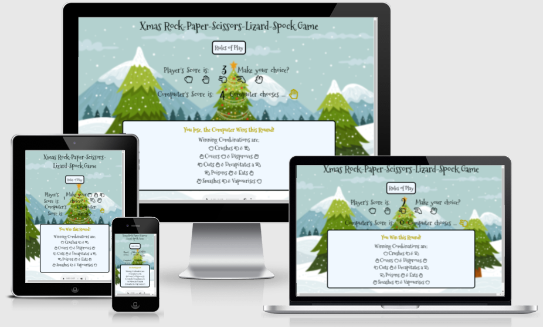

# ROCK PAPER SCISSORS

# PURPOSE
## Introduction:
Rock paper scissors is often used as a fair choosing method between two people, similar to coin flipping, drawing straws, or throwing dice in order to settle a dispute or make an unbiased group decision.  

* [Here is a link to the final project GITHUB POST](https://bellsmith15.github.io/rock-paper-sissors-game/)
## FINAL DESIGN

## INITIAL IDEA CONCEPT
My initial idea for the project was to create a game that is simple to use and competitive. The game is for people of all ages as a light bit of fun! I have choosen to give the game a christmas feel as I am submitting this in December 

#  
## Table of Contents

- [ROCK PAPER SCISSORS](#rock-paper-scissors)
  - [PURPOSE](#purpose)
  - [FINAL DESIGN](#final-design)
  - [INITIAL IDEA CONCEPT](#initial-idea-concept)
- 
  - [TABLE OF CONTENTS](#table-ofcontents)
  - [UX/UI](#uxui)
  - [USER STORIES](#user-stories)
  - [FEATURES](#features)
  - [DESIGN](#design)
- [TESTING](#testing)
- [TECHNOLOGIES USED](#technologies-used)
  - [PROGRAMS USED](#programs-used)
- [DEPLOYMENT](#deployment)
- [CREDITS AND REFERENCES](#credits-and-references)
  - [REFERENCE MATERIAL](#reference-material)
- [ACKNOWLEDGEMENTS:](#acknowledgements)

#
# UX/UI

## The Strategy Plane
Rock-Paper-Scissors-Lizard-Spock Game is intended to be a light hearted game for an individual to play for a short period of time. 

Site Goals
- To provide users with a fun and simple game to play.
- To ensure that navigating the site is easy and intuitive for the user.
- To provide users with rules on how to play the game.
- To create a single page site that is easy to navigate through.
- To create a site that is simple in appearance by adding basic colours and layouts.
- To update the user wiith their progress throughout the game.

## USER STORIES
User Stories
- As a user I want a fun and simple game to play
- As a user, I want a clear understanding of the game rules and how to win.
- As a user, I want to see my score progress if I am the round winner.
- As a user, I want my opponents score to progress if I am the loser of the round.
- As a user, I want a message to appear, notifying me of the round winner.
- As a user, I want to be notified if I have won or lost the game.
- As a user, I want to be able to pause or play the game audio.

# FEATURES

## The Scope Plane

Features planned:
* Responsive Design - The game / site should function correctly on screen sizes such as Mobile devices, Tablets, Laptops and Desktops for User to access. 
* Navigation elements should be contained within the game screen.
* Audio elements should be clearly visible to the user so that they can toggle audio on / off whilst playing the game.

## The Structure Plane

User Story:
`As a user, I want a fun and simple game to play.`

Acceptance Criteria:
* It should be clear how to play the game.

Implementation:
* The layout of the foreground and background will make it clear for the user to follow the game as it plays. There will be a button to the rules of the game on the page so the user can easily learn how to play and access information about the game.

User Story:
`As a user, I want to know what the score is.`

Acceptance Criteria: 
* It should be clear what both the user score and computer score is. This will let the user know if they are winning or not.

Implementation:
* There will be a scoreboard that will display the scores for both the Player and Computer. 

User Story:
`As a user, I want to know who won.`

Acceptance Criteria:
* It should clear who has won the overall game after all rounds haev been played.

Implementation:
* There will be a modal that will appear on the screen that will display who has won and what the finishing scores were.

User Story:
`As a user, I want to have some atmosphere included with some music.`

Acceptance Criteria:
* It should clear that a user can play audio music with a christmas theme whislt playing. https://pixabay.com/music/search/genre/christmas/

Implementation:
* An icon will be on the page to allow the user to toggle the audio on the game either on or off.

## The Skeleton Plane

My initial thoughts for the design for the game was to have a central area in the middle of the page for the user to play the game. At the top woul dbe a heading with the game title, then a rules of play modal that popped out the instructions for the user.  Underneath this a section for the Players choices and scores. The next section would be a results area then the last item would be an audio element to an some atmosphere to the Christmas theme.

# DESIGN

## The Surface Plane

Design:
I wanted to have some visuals for the user and decided to have a background for a christmas image and use the foreground to contain the game elements.

* Background Image:
I wanted to give my site a chrismas theme and sourced the background vector image from vecteezy.com website where it is free for download and use. (vecteezy_mountain-winter-view-christmas-tree-background_.jpg)

* Color Schemes:
To ensure that the colours used for different elements provided the required contrast ratio the colour codes were loaded into a contrast checker available at Contrast Grid.

* Typography:
Google fonts was utilised to find a font that would be clean and clear for all users, whilst still conveying an element of fun. I eventually settled on a choice of Festive and Mountains of Christmas.

* Icons:
Font Awesome was used to create the hand icons for the game and audio buttons.

* Features:
The User can click on the Rules button that will open a modal with the instructions of how to play.  There are two modals available from the page, one for the rules of the game and one for the results.  I referenced these from W3.

The User having read the instructions can then play on the game screen and make their choice to play against the computer.

A display shows the current score for both players until the total amount of rounds has been played.

The end result is displayed showing whether the user or computer wins or loses the game. The display can be close then the game is ready for another play.

## Future Enhancements

* Leaderboard - It would be nice for a player to enter their name and that their scores against the computer could be recorded onto a Leaderboard.

* It would be nice to improve the audio button and make a button with pause and play on a smaller icon

* Snow effect - I tried to have an animation of snow running in the background in between the backgroud and foreground I would like to see if I can add this to the project at a later date.

# TESTING

## DEVICES

Desktop
Laptops
Tablet
Mobile
* Android
* Apple

Browsers
- Chrome
- Edge
- Firefox

# Validator Testing

## Validators:

* HTML

No errors were returned when passing through the official W3C HTML Validator Service. Link here: https://validator.w3.org/

* CSS

No errors were returned when passing through the official W3C CSS Validation Service. Link here: https://jigsaw.w3.org/

* JavaScript

No errors were returned when passing through the validator service at JSHint.com. Link here: https://jshint.com/

* Lighthouse
The report returned a good report Performance, Best Practise and SEO returned 100% Accessibility returned 94% on contrast which I am happy to leave as this is a high score.

* Notable Bugs
In HTML I reviewed all the coding bugs and amended them to pass. Mainly working on the audio code that threw some bugs in.
On CSS I amended some typos in the code and put best practices in to return a clear validation

## TECHNOLOGIES USED

* HTML
* CSS
* JAVASCRIPT

### PROGRAMS USED

* GIT
`For version control, commiting and pushing to github`
* GITPOD
`The IDE used to code the game`
* GITHUB
`Used to store repositories, files and images pushed from gitpod`
* Am I Responsive
`Used to test responsiveness of the game at different screen sizes`
* CHROME Developer tools
`For checking compatibilty, troubleshooting and editing code`

## DEPLOYMENT

The Game was deployed using GitHub Pages with the following the steps:

1. Click on the `Settings` icon at the top of page in the navigation bar
2. Scroll down until you see `Github Pages`
3. There will be a message box saying "Check it out here" Click on the link to take you to the next page
4. Here you will be greated with a form, Choose the repository `rock-paper-sissors-game`
5. Choose the branch in the drop down box, in this case `MAIN`
6. Choose the directory in the next drop down box, in this case `Root` select the master branch
7. Then click `Save`
8. It takes a few seconds for the game to publish, once live, the box at the top of the page with the site name will turn green and have a `Green` tick to the left of the link. The page is automatically refreshed with a detailed ribbon display to indicate the successful deployment.

* These commands were used for version control during project:

    * git add . - to add files before committing
    * git commit -m `example message` - to commit changes to the local repository
    * git push - to push all committed changes to the GitHub repository

## CREDITS AND REFERENCES

* The background image of the trees was obtained from Vecteezy.com
* The audio file was found from the pixabay site where the downloads are Royalty free and can be used for sites. https://pixabay.com/music/search/genre/christmas/
* http://ami.responsivedesign.is/#  was used to display responsiveness on different devices.

## Reference Material

W3 Schools was used as a reference point for HTML, CSS and JavaScript
Full Stack Overflow was used as a source of reference
MDN Web Docs was also used as a reference point for HTML, CSS and JavaScript

## ACKNOWLEDGEMENTS:

- My Mentor for encouraging me to research audio and animation references and the advice given for improving the site.
- Code Institute for the Tutors on the course.
- My family for their support.
- Media support on W3 Schools, Stack Overflow, Blogs, Tutorialls online and MDN Weeb docs.
